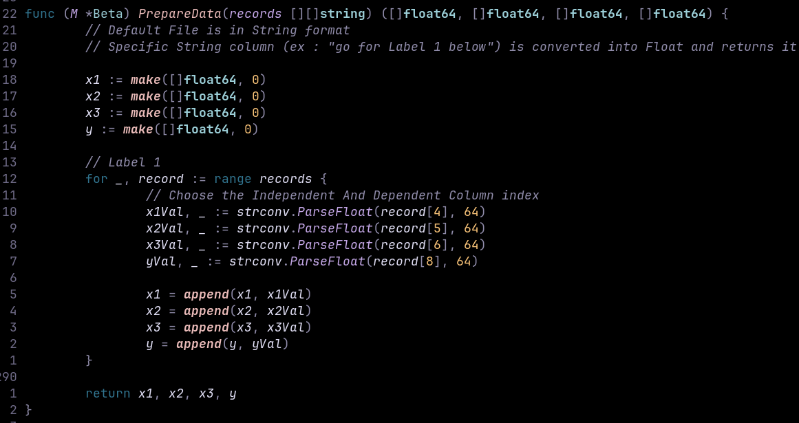
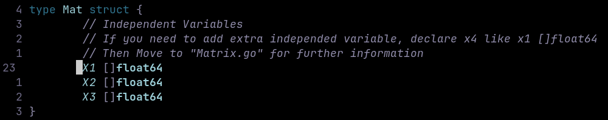

### Stock Price Prediction using Multiple Linear Regression in Go Lang

## No External Libraries are used for Model building

## Built from scratch.

### Once Cloned

do update the mod file

```bash
go mod tidy
```

### To choose Independent and Dependent variable

Go to <b>"PrepareData func"</b> in Prediction/train.go



You will see like this, inside <b>"for loop (Ex : x1Val, \_ := strconv.ParseFloat(record[4],64))"</b><br/>
" Here X represents Independent variable and Y is for Dependent variable"<br/>
Change <b>"record[4] to record[your-index-value]"</b>


### How Add Independent Variable Slice ?
To add independent variables slice go to "Prediction/train.go"<br/>
There's a Mat struct you can see that



Declare Your variable there and read the comments for furthur updates

### To run model?

```bash
go run .  or go run main.go
```
